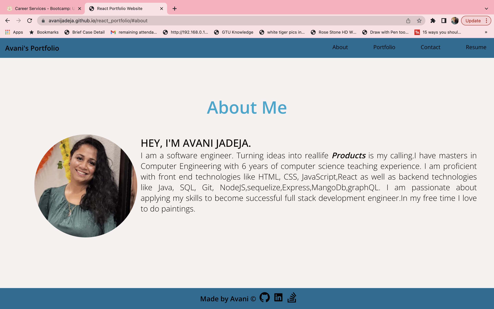
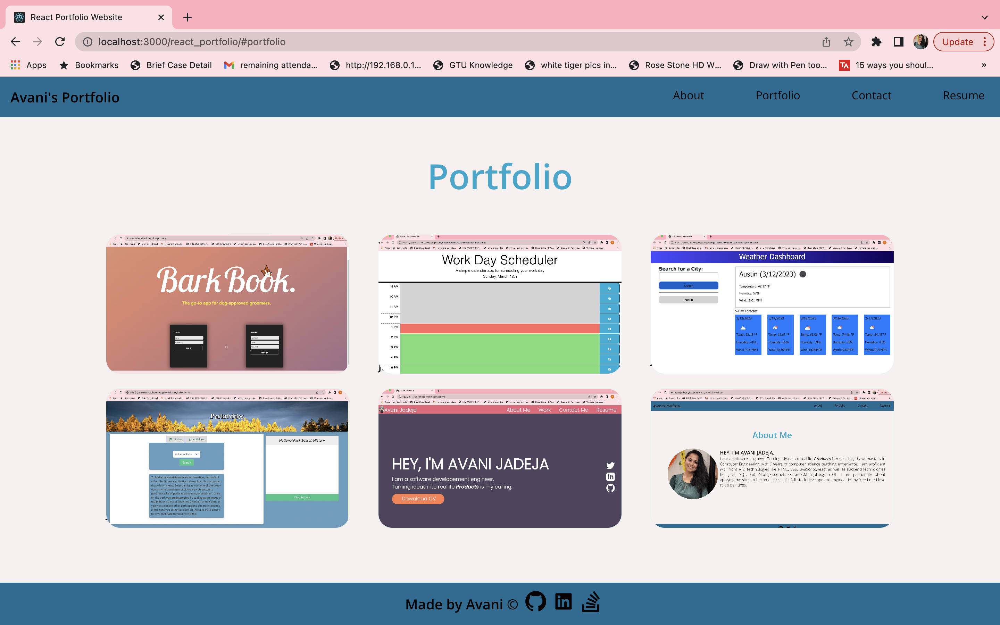
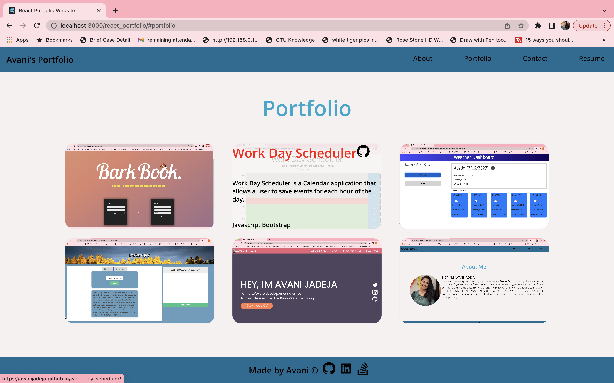

# React Portfolio

Avani Jadeja's Portfolio using React.

# Description

React_portfolio application user can see Avani Jadeja's Portfolio. I created this portfolio using my react skills.So using this portfolio, I can share my work through my latest projects with my fellow developers and collaborate on future projects.

In React portfolio application,

GIVEN a single-page application portfolio for a web developer

- WHEN user load the portfolio,
  THEN user presented with a page containing a header, a section for content, and a footer.

- WHEN user view the header,
  THEN user presented with the developer's name and navigation with titles corresponding to different sections of the portfolio.

- WHEN user view the navigation titles,
  THEN user presented with the titles About Me, Portfolio, Contact, and Resume, and the title corresponding to the current section is highlighted.

- WHEN user click on a navigation title,
  THEN user presented with the corresponding section below the navigation without the page reloading and that title is highlighted.

- WHEN user load the portfolio the first time,
  THEN the About Me title and section are selected by default.

- WHEN user presented with the About Me section,
  THEN user see a recent photo or avatar of the developer and a short bio about them.

- WHEN user presented with the Portfolio section,
  THEN user see titled images of six of the developer’s applications with links to both the deployed applications and the corresponding GitHub repository.

- WHEN user presented with the Contact section,
  THEN user see a contact form with fields for a name, an email address, and a message.

- WHEN user move my cursor out of one of the form fields without entering text,
  THEN user receive a notification that this field is required.

- WHEN user enter text into the email address field,
  THEN user receive a notification if I have entered an invalid email address

- WHEN user presented with the Resume section,
  THEN user see a link to a downloadable resume and a list of the developer’s proficiencies.

- WHEN user view the footer,
  THEN user presented with text or icon links to the developer’s GitHub and LinkedIn profiles, and their profile on a third platform (Stack Overflow, Twitter).

# Table of Contents

- [Installation](#installation)
- [Usage](#usage)
- [Credits](#credits)
- [License](#license)

# Installation

- Create React application using command - npx create-react-app my-app.

- using npm install -  install all packages for application.

- using command npm run start -  user can run this application in the browser.

# Usage

The URL of the functional, deployed application. - https://avanijadeja.github.io/react_portfolio/

The URL of the GitHub repository - https://github.com/avanijadeja/react_portfolio

# License

This project is using the MIT License.

# Badges

